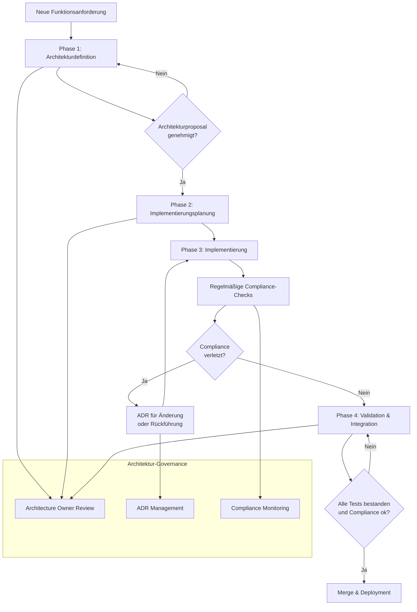

# AGENTS.md

This file provides guidance to agents when working with code in this repository.

## Core Architecture & Patterns (Manchester Parsing)
- **MC Parsing Chain:** `MCParser.parse()` calls `protocols.demodulate_mc()`, which uses `ManchesterMixin._demodulate_mc_data()` for length/clock checks before calling the specific `mcBit2*` method.
- **TFA Protocol Gotcha:** `mcBit2TFA` implements duplicate message detection by chunking the *entire* received bitstream, not just the expected message length.
- **Grothe Constraint:** `mcBit2Grothe` enforces an *exact* 32-bit length, overriding general length checks.
- **Test Mocking:** MC Parser tests mock `mock_protocols.demodulate` to simulate the output of the protocol layer, not `demodulate_mc` directly.
- **Bit Conversion:** `_convert_mc_hex_to_bits` handles `polarity_invert` and firmware version toggling for polarity.

## Verification Execution
- Das Hauptprogramm für Verifizierungen sollte wie folgt gestartet werden:
  `python3 main.py --timeout 1`
  oder um eine längere Laufzeit zu analysieren:
  `python3 main.py --timeout 30`

## Test Timeout Configuration
- Für pytest wurde ein globaler Timeout von 30 Sekunden in der `pyproject.toml` konfiguriert:
  ```toml
  [tool.pytest.ini_options]
  timeout = 30
  ```
- Die erforderliche Abhängigkeit `pytest-timeout` wurde zur `requirements-dev.txt` hinzugefügt.

## Mandatory Documentation and Test Maintenance

Diese Richtlinie gilt für alle AI-Agenten, die Code oder Systemkonfigurationen in diesem Repository ändern. Jede Änderung **muss** eine vollständige Analyse der Auswirkungen auf die zugehörige Dokumentation und die Testsuite umfassen.

### 1. Dokumentationspflicht
- **Synchronisierung:** Die Dokumentation muss synchron zu allen vorgenommenen Änderungen aktualisiert werden, um deren Genauigkeit und Vollständigkeit sicherzustellen.
- **Bereiche:** Betroffene Dokumentationsbereiche umfassen:
  - `docs/`‑Verzeichnis (AsciiDoc‑Dateien)
  - Inline‑Kommentare und Docstrings
  - README.md und andere Markdown‑Dateien
  - API‑Referenzen und Benutzerhandbücher
- **Prüfung:** Vor dem Abschluss einer Änderung ist zu verifizieren, dass alle dokumentationsrelevanten Aspekte berücksichtigt wurden.

### 2. Test‑Pflicht
- **Bestehende Tests:** Die bestehenden Tests sind zu überprüfen und anzupassen, um die geänderten Funktionalitäten korrekt abzudecken.
- **Neue Tests:** Bei Bedarf sind neue Tests zu erstellen, um eine vollständige Testabdeckung der neuen oder modifizierten Logik zu gewährleisten.
- **Test‑Verzeichnis:** Alle Tests befinden sich im `tests/`‑Verzeichnis und müssen nach der Änderung weiterhin erfolgreich ausführbar sein.
- **Test‑Ausführung:** Vor dem Commit ist die Testsuite mit `pytest` (oder dem projektspezifischen Testrunner) auszuführen, um Regressionen auszuschließen.

### 3. Verbindlichkeit
- Diese Praxis ist für **jede** Änderung verbindlich und nicht verhandelbar.
- Ein Commit, der die Dokumentation oder Tests nicht entsprechend anpasst, ist unzulässig.
- Agenten müssen sicherstellen, dass ihre Änderungen den etablierten Qualitätsstandards des Projekts entsprechen.

### 4. Checkliste vor dem Commit
- [ ] Dokumentation im `docs/`‑Verzeichnis aktualisiert
- [ ] Inline‑Kommentare und Docstrings angepasst
- [ ] README.md und andere Markdown‑Dateien geprüft
- [ ] Bestehende Tests angepasst und erfolgreich ausgeführt
- [ ] Neue Tests für geänderte/neue Logik erstellt
- [ ] Gesamte Testsuite (`pytest`) ohne Fehler durchgelaufen
- [ ] Änderungen mit den Projekt‑Konventionen konsistent

Diese Richtlinie gewährleistet, dass Code‑Änderungen nicht isoliert, sondern im Kontext des gesamten Projekts betrachtet werden und die langfristige Wartbarkeit sowie die Zuverlässigkeit der Software erhalten bleibt.

## Architecture-First Development Process

Dieser Abschnitt definiert den verbindlichen Arbeitsablauf für die Entwicklung neuer Funktionen im PySignalduino-Projekt. Der zentrale Grundsatz lautet: **Jede neue Funktion beginnt mit einer vorausschauenden Erweiterung der Architekturdokumentation.** Diese dokumentierte Architektur dient als die einzige verbindliche Spezifikation und der primäre Leitfaden für alle nachfolgenden Implementierungsschritte.

### Grundprinzipien

1. **Architektur vor Code:** Design-Entscheidungen müssen zuerst in der Dokumentation reflektiert und abgestimmt werden, bevor jeglicher Code geschrieben wird.
2. **Dokumentation als Single Source of Truth:** Die Architekturdokumentation ist die autoritative Referenz für alle Implementierungsentscheidungen.
3. **Traceability:** Jede Code-Änderung muss auf eine spezifische Architekturentscheidung zurückführbar sein.
4. **Compliance-Checks:** Implementierungen müssen regelmäßig auf Konformität mit der dokumentierten Architektur überprüft werden.

### Vier-Phasen-Prozess

#### Phase 1: Architekturdefinition mit verbindlichem Architekturproposal
- **Ziel:** Erstellung eines vollständigen Architekturproposals, das alle Design-Entscheidungen dokumentiert
- **Aktivitäten:**
  - Anforderungsanalyse und Scope-Definition
  - Erstellung von Architekturdiagrammen (Mermaid, PlantUML)
  - Definition von Schnittstellen und Datenmodellen
  - Risikoanalyse und Alternativenbewertung
  - Erstellung eines Architecture Decision Record (ADR)
- **Deliverables:**
  - Architekturproposal im AsciiDoc-Format
  - Mermaid-Diagramme für Komponenten- und Sequenzabläufe
  - ADR im `docs/architecture/decisions/` Verzeichnis
  - Review-Protokoll mit Genehmigung durch Architecture Owner

#### Phase 2: Implementierungsplanung basierend auf genehmigter Architektur
- **Ziel:** Detaillierte Planung der Implementierungsschritte unter strikter Einhaltung der Architektur
- **Aktivitäten:**
  - Aufteilung in konkrete Arbeitspakete (Tasks)
  - Definition von Akzeptanzkriterien für jede Komponente
  - Planung von Teststrategien (Unit, Integration, System)
  - Ressourcen- und Zeitplaning
  - Erstellung von Mockups/Prototypen für kritische Pfade
- **Deliverables:**
  - Implementierungsplan mit Task-Breakdown
  - Testplan mit Coverage-Zielen
  - Prototypen für Risikokomponenten
  - Genehmigung durch Feature Developer und Reviewer

#### Phase 3: Implementierung mit strikter Konformität zur Architektur
- **Ziel:** Code-Entwicklung unter ständiger Referenzierung der Architekturdokumentation
- **Aktivitäten:**
  - Iterative Entwicklung gemäß Implementierungsplan
  - Regelmäßige Architektur-Compliance-Checks
  - Dokumentation von Abweichungen und deren Begründung
  - Kontinuierliche Integration und Code-Reviews
  - Anpassung der Dokumentation bei notwendigen Änderungen
- **Deliverables:**
  - Vollständiger implementierter Code
  - Aktualisierte Dokumentation (Inline-Kommentare, Docstrings)
  - Testsuite mit ausreichender Coverage
  - Compliance-Report gegenüber Architekturproposal

#### Phase 4: Validation & Integration mit Architektur-Compliance-Checks
- **Ziel:** Validierung der Implementierung gegen Architekturanforderungen und Integration in das Gesamtsystem
- **Aktivitäten:**
  - Ausführung aller Tests (Unit, Integration, System)
  - Architektur-Compliance-Review durch Architecture Owner
  - Performance- und Sicherheitsaudits
  - Integrationstests mit bestehenden Komponenten
  - Endgültige Dokumentationsprüfung
- **Deliverables:**
  - Testberichte und Coverage-Report
  - Compliance-Zertifizierung durch Architecture Owner
  - Finalisierte Dokumentation
  - Merge-Request mit vollständiger Nachweisbarkeit

### Rollen und Verantwortlichkeiten

#### Architecture Owner
- **Verantwortlichkeiten:**
  - Genehmigung von Architekturproposals
  - Durchführung von Architektur-Reviews
  - Compliance-Checks während der Implementierung
  - Finale Freigabe für Integration
- **Befugnisse:**
  - Veto-Recht bei Architekturverstößen
  - Anforderung von Design-Änderungen
  - Genehmigung von ADRs

#### Feature Developer
- **Verantwortlichkeiten:**
  - Erstellung von Architekturproposals
  - Implementierung gemäß genehmigter Architektur
  - Dokumentation von Design-Entscheidungen
  - Durchführung von Selbst-Checks auf Compliance
- **Befugnisse:**
  - Vorschlag von Architekturalternativen
  - Beantragung von Architektur-Änderungen via ADR
  - Code-Reviews für Teammitglieder

#### Reviewer
- **Verantwortlichkeiten:**
  - Code-Review mit Fokus auf Architekturkonformität
  - Prüfung der Testabdeckung
  - Validierung der Dokumentationsaktualität
  - Sicherstellung der Wartbarkeit
- **Befugnisse:**
  - Blockierung von Merge-Requests bei Compliance-Problemen
  - Anforderung zusätzlicher Tests
  - Empfehlung für Architecture Owner

### Architecture Documentation Standards

#### AsciiDoc-Templates
Alle Architekturdokumente müssen den standardisierten Templates folgen:
- **Architekturproposal:** `docs/architecture/templates/proposal_template.adoc`
- **ADR (Architecture Decision Record):** `docs/architecture/templates/adr_template.adoc`
- **Komponentenbeschreibung:** `docs/architecture/templates/component_template.adoc`

#### Mermaid-Diagramme
- **Verpflichtende Diagrammtypen:**
  - Komponentendiagramm (Component Diagram)
  - Sequenzdiagramm (Sequence Diagram)
  - Zustandsdiagramm (State Diagram) bei komplexen Zustandsmaschinen
- **Einbettung:** Direkte Einbettung in AsciiDoc-Dokumente via `[mermaid]`-Block
- **Versionierung:** Diagramme müssen im `docs/architecture/diagrams/` Verzeichnis als `.mmd`-Dateien gespeichert werden

#### ADRs (Architecture Decision Records)
- **Format:** Lightweight ADR gemäß MADR-Standard
- **Speicherort:** `docs/architecture/decisions/`
- **Nummerierung:** Sequentiell (ADR-001, ADR-002, ...)
- **Inhalt:** Kontext, Entscheidung, Konsequenzen, Alternativen

### Erweiterte Checkliste vor dem Commit

Diese Checkliste erweitert die bestehende Checkliste um Architektur-spezifische Prüfpunkte:

#### Architektur-Compliance
- [ ] Architekturproposal liegt vor und ist genehmigt
- [ ] ADR für alle wesentlichen Design-Entscheidungen erstellt
- [ ] Implementierung folgt den spezifizierten Schnittstellen
- [ ] Keine Verletzung von Architekturprinzipien (z.B. Single Responsibility)
- [ ] Datenmodelle entsprechen den definierten Schemata

#### Dokumentation
- [ ] Architekturdokumentation aktualisiert (AsciiDoc-Dateien)
- [ ] Mermaid-Diagramme auf Aktualität geprüft
- [ ] Inline-Kommentare und Docstrings angepasst
- [ ] API-Referenzen konsistent mit Implementierung
- [ ] README.md und andere Markdown-Dateien geprüft

#### Tests
- [ ] Bestehende Tests angepasst und erfolgreich ausgeführt
- [ ] Neue Tests für geänderte/neue Logik erstellt
- [ ] Architektur-spezifische Integrationstests vorhanden
- [ ] Test-Coverage mindestens 80% für neue Komponenten
- [ ] Gesamte Testsuite (`pytest`) ohne Fehler durchgelaufen

#### Code-Qualität
- [ ] Code-Review durch Reviewer durchgeführt
- [ ] Architektur-Compliance-Check durch Architecture Owner
- [ ] Linting (`ruff`, `black`) ohne Fehler
- [ ] Type-Checks (`mypy`) erfolgreich
- [ ] Änderungen mit den Projekt-Konventionen konsistent

### Prozessvisualisierung



### Verbindlichkeit

Dieser Architecture-First Development Process ist für **alle** neuen Funktionen und wesentlichen Änderungen verbindlich. Ausnahmen sind nur bei kritischen Bugfixes erlaubt und müssen durch einen Emergency-ADR dokumentiert werden. Jede Abweichung vom Prozess muss vom Architecture Owner genehmigt werden.

Die Einhaltung dieses Prozesses gewährleistet, dass Design-Entscheidungen bewusst getroffen, dokumentiert und nachvollziehbar sind, was die langfristige Wartbarkeit, Skalierbarkeit und Qualität des PySignalduino-Projekts sicherstellt.

## Fehlerbehebungsprozess für fehlende Abhängigkeiten

### Problemidentifikation
1. **Symptom:** ImportError oder ModuleNotFoundError während der Testausführung
2. **Ursachenanalyse:**
   - Überprüfen der Traceback-Meldung auf fehlende Module
   - Vergleich mit requirements.txt und requirements-dev.txt
   - Prüfen der Dokumentation auf Installationsanweisungen

### Lösungsimplementierung
1. **requirements-dev.txt aktualisieren:**
   - Modulname zur Datei hinzufügen
   - Commit mit Conventional Commits Syntax erstellen (z.B. "fix: add <module> to requirements-dev.txt")
2. **Dokumentation prüfen:**
   - Sicherstellen, dass Installationsanweisungen in README.md und docs/ aktuell sind

### Verifikation
1. **Installation testen:**
   ```bash
   pip install -r requirements-dev.txt
   pytest
   ```
2. **Tests erneut ausführen:**
   ```bash
   timeout 60 pytest ./tests/
   ```

### Dokumentation
- **AGENTS.md aktualisieren:** Diese Prozessbeschreibung hinzufügen
- **Commit erstellen:** Änderungen mit aussagekräftiger Nachricht committen