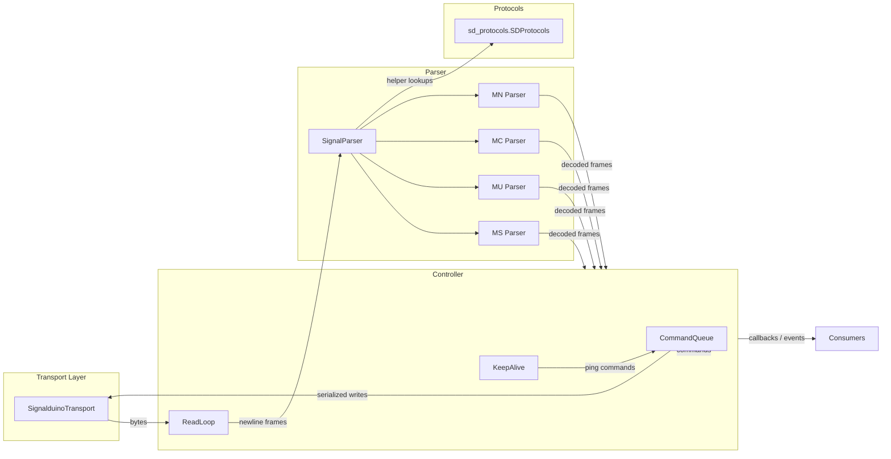

# SIGNALDuino Communication Migration Plan

## Goals
- Port every part of `temp_repo/FHEM/00_SIGNALduino.pm` that talks directly to the microcontroller over serial or TCP into Python.
- Reuse the existing `sd_protocols` package for *all* signal processing, instead of Perl's `lib::SD_Protocols`.
- Provide a reusable Python API that can establish the connection, manage the send queue/keepalive logic, and surface decoded protocol frames to downstream consumers (MQTT bridge, tests, etc.).

## Scope & Priorities
1. **Communication layer**
   - Connection setup/teardown for both serial devices (USB) and TCP sockets.
   - Command queueing, rate limiting, keepalive handling, and firmware command support that currently lives in `SIGNALduino_Write`, `SIGNALduino_AddSendQueue`, `SIGNALduino_KeepAlive`, etc.
2. **Signal parsing**
   - Port `SIGNALduino_Read`, `SIGNALduino_Split_Message`, and the MS/MU/MC/MN parser family.
   - Replace Perl-only helpers with Python equivalents that rely on `sd_protocols` (e.g. `length_in_range`, `postDemodulation`, `mcBit2*` handlers).
3. **Dispatch/events**
   - Provide Python callbacks (instead of FHEM `Dispatch`) so that decoded frames can be consumed by higher-level code (e.g. MQTT bridge, tests, etc.).
4. **Firmware Management**
   - Port the firmware update logic: fetching releases from GitHub, downloading artifacts, and flashing via `avrdude`.

## Proposed Python Package Layout
```
signalduino/
├── __init__.py
├── constants.py          # SDUINO_* timing values, defaults, etc.
├── exceptions.py        # Custom exception types
├── transport.py         # SerialTransport, TCPTransport, base class
├── types.py             # Dataclasses for raw/decoded frames and command responses
├── queue.py             # (optional) helpers for command queue bookkeeping
├── parser/
│   ├── __init__.py
│   ├── base.py          # Shared parsing utilities (split message, RSSI calc, regex guards)
│   ├── ms.py            # Port of SIGNALduino_Parse_MS
│   ├── mu.py            # Port of SIGNALduino_Parse_MU
│   ├── mc.py            # Port of SIGNALduino_Parse_MC
│   └── mn.py            # Port of SIGNALduino_Parse_MN
├── firmware.py          # Firmware update logic (GitHub API, download, flash)
└── controller.py        # High-level SignalduinoDevice orchestrating transport, parser, queue, keepalive
```

### Responsibilities per module
- `constants.py`: Keep Perl defaults (timeouts, version string, queue delays) for easy tuning and to stay compatible with firmware expectations.
- `transport.py`: Abstract over serial (`pyserial`) vs TCP sockets, expose a uniform interface with `open()`, `close()`, `readline()`, `write()`.
- `controller.py`: Implements
  - configuration parsing akin to `SIGNALduino_Define`
  - background read loop mirroring `SIGNALduino_Read`
  - command queue & pending command tracking (`ucCmd` replacement)
  - keepalive timer and automatic reconnects similar to `SIGNALduino_KeepAlive` + `SIGNALduino_Ready`
  - callback registration for decoded frames & raw events
- `parser/*`: Pure functions/classes that accept a `SDProtocols` instance, raw firmware line, and return zero or more `DecodedMessage` objects with metadata (protocol id, RSSI, freq AFC, raw message). These modules port `SIGNALduino_Split_Message`, pattern lookup helpers, etc., but use Python data structures and `sd_protocols` helpers.
- `firmware.py`: Handles firmware updates.
  - `check_for_updates(hardware, channel)`: Queries GitHub releases.
  - `download_firmware(url, target_path)`: Downloads the .hex file.
  - `flash_firmware(device_path, hex_file, hardware_type, flash_command)`: Invokes `avrdude` (or other tools) to flash the device. Handles special reset logic (e.g. Radino 1200 baud touch).

## High-Level Data Flow


## Parsing Strategy
| Perl Source | Python Target | Notes |
|-------------|---------------|-------|
| `SIGNALduino_Split_Message`, `_limit_to_number`, `_limit_to_hex`, `SIGNALduino_calcRSSI` | `parser/base.py` | Pure helpers + dataclass for parsed firmware frame. |
| `SIGNALduino_Parse_MS` | `parser/ms.py` | Same lookup-table demod logic, but rely on `sd_protocols` methods (`length_in_range`, `postDemodulation`, etc.). |
| `SIGNALduino_Parse_MU` | `parser/mu.py` | Keep regex guards, `PatternExists`, `FillPatternLookupTable` rewritten in Python. |
| `SIGNALduino_Parse_MC` | `parser/mc.py` | Convert hex payload to bitstring, route to `sd_protocols` Manchester helpers via dynamic dispatch. |
| `SIGNALduino_Parse_MN` | `parser/mn.py` | Use protocol regex/length checks, produce decoded hex for dispatch. |

`sd_protocols` already exposes the majority of helpers used inside Perl (`binStr2hexStr`, `mcBit2*`, `postDemo_*`). If a helper is missing, we will extend `sd_protocols` rather than duplicating logic in the parser.

## Command Lifecycle
1. Public API (`SignalduinoDevice.send_command(...)`) pushes a command onto `CommandQueue`.
2. Queue worker enforces `SDUINO_WRITEQUEUE_NEXT` delays and `SDUINO_WRITEQUEUE_TIMEOUT` for commands that expect explicit firmware responses.
3. Responses are correlated via simple matchers (regex or lambda) derived from the Perl `%gets` table.
4. Keepalive schedules periodic `ping` commands. If `SDUINO_KEEPALIVE_MAXRETRY` is exceeded, the controller tears down and reconnects.

## Firmware Update Strategy
| Perl Source | Python Target | Notes |
|-------------|---------------|-------|
| `SIGNALduino_querygithubreleases` | `firmware.fetch_releases` | Use `requests` or `aiohttp` to query GitHub API. |
| `SIGNALduino_githubParseHttpResponse` | `firmware.parse_releases` | Parse JSON, filter by hardware/channel (stable/testing). |
| `SIGNALduino_Set_flash` | `controller.flash_firmware` | Entry point. Orchestrates download + flash. |
| `SIGNALduino_ParseHttpResponse` (flash part) | `firmware.download_file` | Download logic. |
| `SIGNALduino_PrepareFlash` | `firmware.prepare_flash_command` | Construct `avrdude` command string. Handle Radino reset (1200 baud). |
| `SIGNALduino_avrdude` | `firmware.execute_flash` | Run `subprocess.run` for `avrdude`. |

**Hardware Types to Support:**
- `nano328`, `nanoCC1101` (Standard `avrdude -c arduino`)
- `radinoCC1101` (Special `avrdude -c avr109`, requires 1200 baud reset)
- `ESP32`/`ESP8266` (Currently Perl says "not supported via module", but we should design interfaces to allow `esptool` in future).

## Testing Approach
- **Parser unit tests**: feed captured raw frames from Perl repo (`temp_repo/t/...`) into the Python parsers and assert decoded payloads. These tests do not require hardware.
- **Transport/controller tests**: use `socket.socketpair()` / `io.BytesIO` doubles to simulate firmware responses, ensuring queue timing, keepalive, and callbacks work deterministically.
- **Integration smoke test**: small CLI or pytest fixture that spins up `SignalduinoDevice` against a fake firmware server and validates MS/MU/MC/MN decoding paths.

## Immediate Next Steps
1. Scaffold the `signalduino` package with the modules above and move constant values + dataclasses into place.
2. Implement `transport.py` and `controller.py` skeletons (with dependency injection for easier testing).
3. Port `SIGNALduino_Split_Message` helpers into Python and start with the MC parser (it has the least dependency on lookup tables).
4. Replace Perl-style dispatching with callback registration and build pytest coverage around the new parsers.

---

# Migration Status Matrix

This section lists all subroutines from the original Perl implementation (`00_SIGNALduino.pm` and `SD_Protocols.pm`) and their corresponding migration status in the Python project.

## 00_SIGNALduino.pm

| Perl Subroutine | Python Implementation | Status | Notes |
| :--- | :--- | :--- | :--- |
| `SIGNALduino_Initialize` | `signalduino.controller.SignalduinoController.__init__` | ✅ Migrated | Initialization logic |
| `SIGNALduino_Define` | `signalduino.controller.SignalduinoController.__init__` | ✅ Migrated | Setup and configuration |
| `SIGNALduino_Connect` | `signalduino.controller.SignalduinoController.connect` | ✅ Migrated | Connection handling |
| `SIGNALduino_Disconnect` | `signalduino.controller.SignalduinoController.disconnect` | ✅ Migrated | Disconnection handling |
| `SIGNALduino_Read` | `signalduino.transport.BaseTransport.readline` | ✅ Migrated | Transport layer reading |
| `SIGNALduino_Write` | `signalduino.transport.BaseTransport.write_line` | ✅ Migrated | Transport layer writing |
| `SIGNALduino_SimpleWrite` | `signalduino.controller.SignalduinoController.send_command` | ✅ Migrated | Simple command sending |
| `SIGNALduino_Parse` | `signalduino.parser.__init__.SignalParser.parse_line` | ✅ Migrated | Main parsing entry point |
| `SIGNALduino_Parse_MC` | `signalduino.parser.mc.MCParser.parse` | ✅ Migrated | Manchester parsing |
| `SIGNALduino_Parse_MS` | `signalduino.parser.ms.MSParser.parse` | ✅ Migrated | Message Synced parsing |
| `SIGNALduino_Parse_MU` | `signalduino.parser.mu.MUParser.parse` | ✅ Migrated | Message Unsynced parsing |
| `SIGNALduino_Parse_MN` | `signalduino.parser.mn.MNParser.parse` | ✅ Migrated | Message Noise parsing |
| `SIGNALduino_Set_MessageType` | `signalduino.controller.SignalduinoController.set_message_type_enabled` | ✅ Migrated | Enable/disable message types |
| `SIGNALduino_Set_Freq` | `signalduino.controller.SignalduinoController.set_freq` | ✅ Migrated | Frequency setting |
| `SIGNALduino_Log3` | `logging` module | ✅ Migrated | Standard Python logging used |
| `SIGNALduino_HandleWriteQueue` | `signalduino.controller.SignalduinoController._writer_loop` | ✅ Migrated | Queue processing |
| `SIGNALduino_ResetDevice` | N/A | ❌ Pending | Device reset logic |
| `SIGNALduino_CloseDevice` | `signalduino.transport.BaseTransport.close` | ✅ Migrated | Closing device connection |
| `SIGNALduino_DoInit` | N/A | ❌ Pending | Initialization sequence |
| `SIGNALduino_StartInit` | N/A | ❌ Pending | Start initialization |
| `SIGNALduino_KeepAlive` | N/A | ❌ Pending | Keep-alive mechanism |
| `SIGNALduino_calcRSSI` | `signalduino.parser.base.calc_rssi` | ✅ Migrated | RSSI calculation |
| `SIGNALduino_Attr` | N/A | ❌ Pending | Attribute handling (FHEM specific) |
| `SIGNALduino_Set` | N/A | ❌ Pending | Generic Set command |
| `SIGNALduino_Get` | N/A | ❌ Pending | Generic Get command |
| `SIGNALduino_Shutdown` | N/A | ❌ Pending | Shutdown handling |
| `SIGNALduino_Undef` | N/A | ❌ Pending | Undefine device |
| `SIGNALduino_FingerprintFn` | N/A | ❌ Pending | Fingerprinting |
| `SIGNALduino_Set_FhemWebList` | N/A | ❌ Pending | FHEM Web interaction |
| `SIGNALduino_Set_raw` | N/A | ❌ Pending | Send raw command |
| `SIGNALduino_Set_flash` | N/A | ❌ Pending | Flash firmware |
| `SIGNALduino_Set_reset` | N/A | ❌ Pending | Reset command |
| `SIGNALduino_Attr_rfmode` | N/A | ❌ Pending | RF Mode attribute |
| `SIGNALduino_Set_sendMsg` | N/A | ❌ Pending | Send message command |
| `SIGNALduino_Set_close` | N/A | ❌ Pending | Close command |
| `SIGNALduino_Set_bWidth` | N/A | ❌ Pending | Bandwidth setting |
| `SIGNALduino_Set_LaCrossePairForSec` | N/A | ❌ Pending | LaCrosse pairing |
| `SIGNALduino_Get_Callback` | N/A | ❌ Pending | Get callback |
| `SIGNALduino_Get_FhemWebList` | N/A | ❌ Pending | Get FHEM Web list |
| `SIGNALduino_Get_availableFirmware` | N/A | ❌ Pending | Get available firmware |
| `SIGNALduino_Get_Command` | N/A | ❌ Pending | Get command |
| `SIGNALduino_Get_Command_CCReg` | N/A | ❌ Pending | Get CC register |
| `SIGNALduino_Get_RawMsg` | N/A | ❌ Pending | Get raw message |
| `SIGNALduino_GetResponseUpdateReading` | N/A | ❌ Pending | Update reading from response |
| `SIGNALduino_Get_delayed` | N/A | ❌ Pending | Delayed get |
| `SIGNALduino_CheckUptimeResponse` | N/A | ❌ Pending | Check uptime |
| `SIGNALduino_CheckCmdsResponse` | N/A | ❌ Pending | Check commands response |
| `SIGNALduino_CheckccConfResponse` | N/A | ❌ Pending | Check CC config response |
| `SIGNALduino_CheckccPatableResponse` | N/A | ❌ Pending | Check PA table response |
| `SIGNALduino_CheckCcregResponse` | N/A | ❌ Pending | Check CC register response |
| `SIGNALduino_CheckSendRawResponse` | N/A | ❌ Pending | Check send raw response |
| `SIGNALduino_SimpleWrite_XQ` | N/A | ❌ Pending | Simple write XQ |
| `SIGNALduino_CheckVersionResp` | N/A | ❌ Pending | Check version response |
| `SIGNALduino_CheckCmdResp` | N/A | ❌ Pending | Check command response |
| `SIGNALduino_XmitLimitCheck` | N/A | ❌ Pending | Transmit limit check |
| `SIGNALduino_AddSendQueue` | N/A | ❌ Pending | Add to send queue |
| `SIGNALduino_SendFromQueue` | N/A | ❌ Pending | Send from queue |
| `SIGNALduino_ParseHttpResponse` | N/A | ❌ Pending | Parse HTTP response |
| `SIGNALduino_splitMsg` | N/A | ❌ Pending | Split message |
| `SIGNALduino_inTol` | N/A | ❌ Pending | Tolerance check |
| `SIGNALduino_FillPatternLookupTable` | N/A | ❌ Pending | Fill pattern table |
| `SIGNALduino_PatternExists` | `sd_protocols.pattern_utils.pattern_exists` | ✅ Migrated | Pattern existence check |
| `cartesian_product` | `sd_protocols.pattern_utils.cartesian_product` | ✅ Migrated | Cartesian product |
| `SIGNALduino_MatchSignalPattern` | N/A | ❌ Pending | Match signal pattern |
| `SIGNALduino_Split_Message` | N/A | ❌ Pending | Split message (variant) |
| `SIGNALduno_Dispatch` | N/A | ❌ Pending | Dispatch message |
| `SIGNALduino_moduleMatch` | N/A | ❌ Pending | Module match |
| `SIGNALduino_padbits` | N/A | ❌ Pending | Pad bits |
| `SIGNALduino_WriteInit` | N/A | ❌ Pending | Write initialization |
| `SIGNALduino_FW_Detail` | N/A | ❌ Pending | Firmware detail |
| `SIGNALduino_FW_saveWhitelist` | N/A | ❌ Pending | Save whitelist |
| `SIGNALduino_IdList` | N/A | ❌ Pending | ID list |
| `SIGNALduino_getAttrDevelopment` | N/A | ❌ Pending | Get dev attribute |
| `SIGNALduino_callsub` | N/A | ❌ Pending | Call subroutine |
| `SIGNALduino_filterMC` | N/A | ❌ Pending | Filter MC |
| `SIGNALduino_filterSign` | N/A | ❌ Pending | Filter signature |
| `SIGNALduino_compPattern` | N/A | ❌ Pending | Compare pattern |
| `SIGNALduino_getProtocolList` | N/A | ❌ Pending | Get protocol list (controller) |
| `SIGNALduino_createLogCallback` | N/A | ❌ Pending | Create log callback |
| `SIGNALduino_FW_getProtocolList` | N/A | ❌ Pending | Get protocol list (FW) |
| `SIGNALduino_querygithubreleases` | N/A | ❌ Pending | Query GitHub releases |
| `SIGNALduino_githubParseHttpResponse` | N/A | ❌ Pending | Parse GitHub response |
| `_limit_to_number` | N/A | ❌ Pending | Limit to number |
| `_limit_to_hex` | N/A | ❌ Pending | Limit to hex |
| `SetPatable` | N/A | ❌ Pending | Set PA table |
| `SetRegisters` | N/A | ❌ Pending | Set registers |
| `SetRegistersUser` | N/A | ❌ Pending | Set registers user |
| `SetDataRate` | N/A | ❌ Pending | Set data rate |
| `CalcDataRate` | N/A | ❌ Pending | Calculate data rate |
| `SetDeviatn` | N/A | ❌ Pending | Set deviation |
| `setrAmpl` | N/A | ❌ Pending | Set amplifier |
| `GetRegister` | N/A | ❌ Pending | Get register |
| `CalcbWidthReg` | N/A | ❌ Pending | Calculate bandwidth register |
| `SetSens` | N/A | ❌ Pending | Set sensitivity |


## lib/SD_Protocols.pm

| Perl Subroutine | Python Implementation | Status | Notes |
| :--- | :--- | :--- | :--- |
| `new` | `sd_protocols.sd_protocols.SDProtocols.__init__` | ✅ Migrated | Class constructor |
| `LoadHashFromJson` | `sd_protocols.sd_protocols.SDProtocols._load_protocols` | ✅ Migrated | Load protocols from JSON |
| `LoadHash` | N/A | ❌ Pending | Legacy load hash |
| `protocolExists` | N/A | ❌ Pending | Check if protocol exists |
| `getProtocolList` | N/A | ❌ Pending | Get list of protocols |
| `getKeys` | `sd_protocols.sd_protocols.SDProtocols.get_keys` | ✅ Migrated | Get protocol keys |
| `checkProperty` | N/A | ❌ Pending | Check protocol property |
| `getProperty` | N/A | ❌ Pending | Get protocol property |
| `getProtocolVersion` | N/A | ❌ Pending | Get protocol version |
| `setDefaults` | `sd_protocols.sd_protocols.SDProtocols.set_defaults` | ✅ Migrated | Set default values |
| `binStr2hexStr` | `sd_protocols.helpers.ProtocolHelpersMixin.bin_str_2_hex_str` | ✅ Migrated | Binary string to hex string |
| `LengthInRange` | `sd_protocols.helpers.ProtocolHelpersMixin.length_in_range` | ✅ Migrated | Check length in range |
| `mc2dmc` | `sd_protocols.helpers.ProtocolHelpersMixin.mc2dmc` | ✅ Migrated | Manchester to differential Manchester |
| `mcBit2Funkbus` | `sd_protocols.manchester.ManchesterMixin.mcBit2Funkbus` | ✅ Migrated | Funkbus protocol |
| `MCRAW` | `sd_protocols.helpers.ProtocolHelpersMixin.mcraw` | ✅ Migrated | Raw Manchester processing |
| `mcBit2Sainlogic` | `sd_protocols.manchester.ManchesterMixin.mcBit2Sainlogic` | ✅ Migrated | Sainlogic protocol |
| `registerLogCallback` | `sd_protocols.sd_protocols.SDProtocols.register_log_callback` | ✅ Migrated | Log callback registration |
| `_logging` | `sd_protocols.sd_protocols.SDProtocols._logging` | ✅ Migrated | Internal logging helper |
| `dec2binppari` | `sd_protocols.helpers.ProtocolHelpersMixin.dec_2_bin_ppari` | ✅ Migrated | Decimal to binary with parity |
| `mcBit2AS` | `sd_protocols.manchester.ManchesterMixin.mcBit2AS` | ✅ Migrated | AS protocol |
| `mcBit2Grothe` | `sd_protocols.manchester.ManchesterMixin.mcBit2Grothe` | ✅ Migrated | Grothe protocol |
| `mcBit2Hideki` | `sd_protocols.manchester.ManchesterMixin.mcBit2Hideki` | ✅ Migrated | Hideki protocol |
| `mcBit2Maverick` | `sd_protocols.manchester.ManchesterMixin.mcBit2Maverick` | ✅ Migrated | Maverick protocol |
| `mcBit2OSV1` | `sd_protocols.manchester.ManchesterMixin.mcBit2OSV1` | ✅ Migrated | OSV1 protocol |
| `mcBit2OSV2o3` | `sd_protocols.manchester.ManchesterMixin.mcBit2OSV2o3` | ✅ Migrated | OSV2/3 protocol |
| `mcBit2OSPIR` | `sd_protocols.manchester.ManchesterMixin.mcBit2OSPIR` | ✅ Migrated | OSPIR protocol |
| `mcBit2SomfyRTS` | `sd_protocols.manchester.ManchesterMixin.mcBit2SomfyRTS` | ✅ Migrated | Somfy RTS protocol |
| `mcBit2TFA` | `sd_protocols.manchester.ManchesterMixin.mcBit2TFA` | ✅ Migrated | TFA protocol |
| `postDemo_EM` | `sd_protocols.postdemodulation.PostdemodulationMixin.postDemo_EM` | ✅ Migrated | EM post-demodulation |
| `postDemo_Revolt` | `sd_protocols.postdemodulation.PostdemodulationMixin.postDemo_Revolt` | ✅ Migrated | Revolt post-demodulation |
| `postDemo_FS20` | `sd_protocols.postdemodulation.PostdemodulationMixin.postDemo_FS20` | ✅ Migrated | FS20 post-demodulation |
| `postDemo_FHT80` | `sd_protocols.postdemodulation.PostdemodulationMixin.postDemo_FHT80` | ✅ Migrated | FHT80 post-demodulation |
| `postDemo_FHT80TF` | `sd_protocols.postdemodulation.PostdemodulationMixin.postDemo_FHT80TF` | ✅ Migrated | FHT80TF post-demodulation |
| `postDemo_WS2000` | `sd_protocols.postdemodulation.PostdemodulationMixin.postDemo_WS2000` | ✅ Migrated | WS2000 post-demodulation |
| `postDemo_WS7035` | `sd_protocols.postdemodulation.PostdemodulationMixin.postDemo_WS7035` | ✅ Migrated | WS7035 post-demodulation |
| `postDemo_WS7053` | `sd_protocols.postdemodulation.PostdemodulationMixin.postDemo_WS7053` | ✅ Migrated | WS7053 post-demodulation |
| `postDemo_lengtnPrefix` | `sd_protocols.postdemodulation.PostdemodulationMixin.postDemo_lengtnPrefix` | ✅ Migrated | Length prefix post-demodulation |
| `Convbit2Arctec` | N/A | ❌ Pending | Convert bits to Arctec |
| `Convbit2itv1` | N/A | ❌ Pending | Convert bits to ITV1 |
| `ConvHE800` | N/A | ❌ Pending | Convert HE800 |
| `ConvHE_EU` | N/A | ❌ Pending | Convert HE EU |
| `ConvITV1_tristateToBit` | N/A | ❌ Pending | Convert ITV1 tristate |
| `PreparingSend_FS20_FHT` | N/A | ❌ Pending | Prepare send FS20/FHT |
| `ConvBresser_5in1` | `sd_protocols.helpers.ProtocolHelpersMixin.ConvBresser_5in1` | ✅ Migrated | Bresser 5in1 conversion |
| `ConvBresser_6in1` | `sd_protocols.helpers.ProtocolHelpersMixin.ConvBresser_6in1` | ✅ Migrated | Bresser 6in1 conversion |
| `ConvBresser_7in1` | `sd_protocols.helpers.ProtocolHelpersMixin.ConvBresser_7in1` | ✅ Migrated | Bresser 7in1 conversion |
| `ConvBresser_lightning` | `sd_protocols.helpers.ProtocolHelpersMixin.ConvBresser_lightning` | ✅ Migrated | Bresser lightning conversion |
| `LFSR_digest16` | `sd_protocols.helpers.ProtocolHelpersMixin.lfsr_digest16` | ✅ Migrated | LFSR digest 16 |
| `ConvPCA301` | `sd_protocols.helpers.ProtocolHelpersMixin.ConvPCA301` | ✅ Migrated | PCA301 conversion |
| `ConvKoppFreeControl` | `sd_protocols.helpers.ProtocolHelpersMixin.ConvKoppFreeControl` | ✅ Migrated | Kopp FreeControl conversion |
| `ConvLaCrosse` | `sd_protocols.helpers.ProtocolHelpersMixin.ConvLaCrosse` | ✅ Migrated | LaCrosse conversion |
| `PreparingSend_KOPP_FC` | N/A | ❌ Pending | Prepare send Kopp FC |
| `_checkInvocant` | N/A | ❌ Pending | Internal helper |
| `STORABLE_freeze` | N/A | ❌ Pending | Storable serialization |
| `STORABLE_thaw` | N/A | ❌ Pending | Storable deserialization |
| `_calc_crc16` | `sd_protocols.helpers.ProtocolHelpersMixin._calc_crc16` | ✅ Migrated | CRC16 Calculation |
| `_calc_crc8_la_crosse` | `sd_protocols.helpers.ProtocolHelpersMixin._calc_crc8_la_crosse` | ✅ Migrated | CRC8 LaCrosse Calculation |

### Legend
- ✅ **Migrated**: Functionality exists in the Python codebase.
- ❌ **Pending**: Functionality has not yet been ported or verified.
- N/A: Not directly applicable or structural change (e.g., class constructor vs. module level sub).
