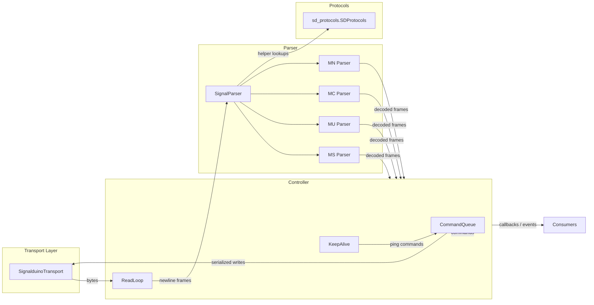

# SIGNALDuino Communication Migration Plan

## Goals
- Port every part of `temp_repo/FHEM/00_SIGNALduino.pm` that talks directly to the microcontroller over serial or TCP into Python.
- Reuse the existing `sd_protocols` package for *all* signal processing, instead of Perl's `lib::SD_Protocols`.
- Provide a reusable Python API that can establish the connection, manage the send queue/keepalive logic, and surface decoded protocol frames to downstream consumers (MQTT bridge, tests, etc.).

## Scope & Priorities
1. **Communication layer**
   - Connection setup/teardown for both serial devices (USB) and TCP sockets.
   - Command queueing, rate limiting, keepalive handling, and firmware command support that currently lives in `SIGNALduino_Write`, `SIGNALduino_AddSendQueue`, `SIGNALduino_KeepAlive`, etc.
2. **Signal parsing**
   - Port `SIGNALduino_Read`, `SIGNALduino_Split_Message`, and the MS/MU/MC/MN parser family.
   - Replace Perl-only helpers with Python equivalents that rely on `sd_protocols` (e.g. `length_in_range`, `postDemodulation`, `mcBit2*` handlers).
3. **Dispatch/events**
   - Provide Python callbacks (instead of FHEM `Dispatch`) so that decoded frames can be consumed by higher-level code (e.g. MQTT bridge, tests, etc.).

## Proposed Python Package Layout
```
signalduino/
├── __init__.py
├── constants.py          # SDUINO_* timing values, defaults, etc.
├── exceptions.py        # Custom exception types
├── transport.py         # SerialTransport, TCPTransport, base class
├── types.py             # Dataclasses for raw/decoded frames and command responses
├── queue.py             # (optional) helpers for command queue bookkeeping
├── parser/
│   ├── __init__.py
│   ├── base.py          # Shared parsing utilities (split message, RSSI calc, regex guards)
│   ├── ms.py            # Port of SIGNALduino_Parse_MS
│   ├── mu.py            # Port of SIGNALduino_Parse_MU
│   ├── mc.py            # Port of SIGNALduino_Parse_MC
│   └── mn.py            # Port of SIGNALduino_Parse_MN
└── controller.py        # High-level SignalduinoDevice orchestrating transport, parser, queue, keepalive
```

### Responsibilities per module
- `constants.py`: Keep Perl defaults (timeouts, version string, queue delays) for easy tuning and to stay compatible with firmware expectations.
- `transport.py`: Abstract over serial (`pyserial`) vs TCP sockets, expose a uniform interface with `open()`, `close()`, `readline()`, `write()`.
- `controller.py`: Implements
  - configuration parsing akin to `SIGNALduino_Define`
  - background read loop mirroring `SIGNALduino_Read`
  - command queue & pending command tracking (`ucCmd` replacement)
  - keepalive timer and automatic reconnects similar to `SIGNALduino_KeepAlive` + `SIGNALduino_Ready`
  - callback registration for decoded frames & raw events
- `parser/*`: Pure functions/classes that accept a `SDProtocols` instance, raw firmware line, and return zero or more `DecodedMessage` objects with metadata (protocol id, RSSI, freq AFC, raw message). These modules port `SIGNALduino_Split_Message`, pattern lookup helpers, etc., but use Python data structures and `sd_protocols` helpers.

## High-Level Data Flow


## Parsing Strategy
| Perl Source | Python Target | Notes |
|-------------|---------------|-------|
| `SIGNALduino_Split_Message`, `_limit_to_number`, `_limit_to_hex`, `SIGNALduino_calcRSSI` | `parser/base.py` | Pure helpers + dataclass for parsed firmware frame. |
| `SIGNALduino_Parse_MS` | `parser/ms.py` | Same lookup-table demod logic, but rely on `sd_protocols` methods (`length_in_range`, `postDemodulation`, etc.). |
| `SIGNALduino_Parse_MU` | `parser/mu.py` | Keep regex guards, `PatternExists`, `FillPatternLookupTable` rewritten in Python. |
| `SIGNALduino_Parse_MC` | `parser/mc.py` | Convert hex payload to bitstring, route to `sd_protocols` Manchester helpers via dynamic dispatch. |
| `SIGNALduino_Parse_MN` | `parser/mn.py` | Use protocol regex/length checks, produce decoded hex for dispatch. |

`sd_protocols` already exposes the majority of helpers used inside Perl (`binStr2hexStr`, `mcBit2*`, `postDemo_*`). If a helper is missing, we will extend `sd_protocols` rather than duplicating logic in the parser.

## Command Lifecycle
1. Public API (`SignalduinoDevice.send_command(...)`) pushes a command onto `CommandQueue`.
2. Queue worker enforces `SDUINO_WRITEQUEUE_NEXT` delays and `SDUINO_WRITEQUEUE_TIMEOUT` for commands that expect explicit firmware responses.
3. Responses are correlated via simple matchers (regex or lambda) derived from the Perl `%gets` table.
4. Keepalive schedules periodic `ping` commands. If `SDUINO_KEEPALIVE_MAXRETRY` is exceeded, the controller tears down and reconnects.

## Testing Approach
- **Parser unit tests**: feed captured raw frames from Perl repo (`temp_repo/t/...`) into the Python parsers and assert decoded payloads. These tests do not require hardware.
- **Transport/controller tests**: use `socket.socketpair()` / `io.BytesIO` doubles to simulate firmware responses, ensuring queue timing, keepalive, and callbacks work deterministically.
- **Integration smoke test**: small CLI or pytest fixture that spins up `SignalduinoDevice` against a fake firmware server and validates MS/MU/MC/MN decoding paths.

## Immediate Next Steps
1. Scaffold the `signalduino` package with the modules above and move constant values + dataclasses into place.
2. Implement `transport.py` and `controller.py` skeletons (with dependency injection for easier testing).
3. Port `SIGNALduino_Split_Message` helpers into Python and start with the MC parser (it has the least dependency on lookup tables).
4. Replace Perl-style dispatching with callback registration and build pytest coverage around the new parsers.
